# About me 
### Full name: Anani Thierry Kassa
### Student ID: 041140713

## Lab Modules
### Module 1 — Provision Azure Resources
Tasks
Create the following resources in Azure Portal:
1.	Resource Group: rg-ai-search-lab
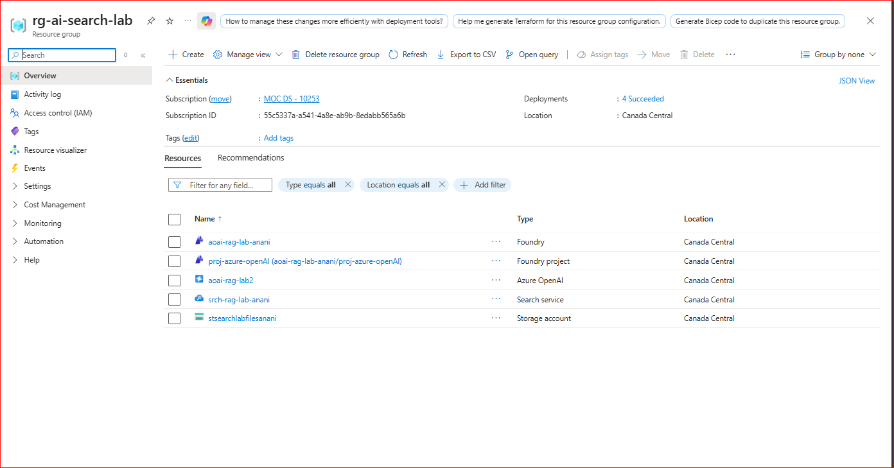
2.	Azure AI Search service: srch-rag-lab
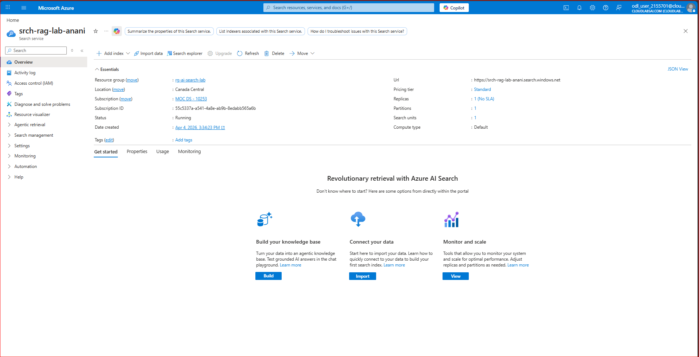
3.	Pricing tier: choose a lab-appropriate tier
4.	Azure OpenAI / Azure AI Foundry-backed OpenAI resource: aoai-rag-lab
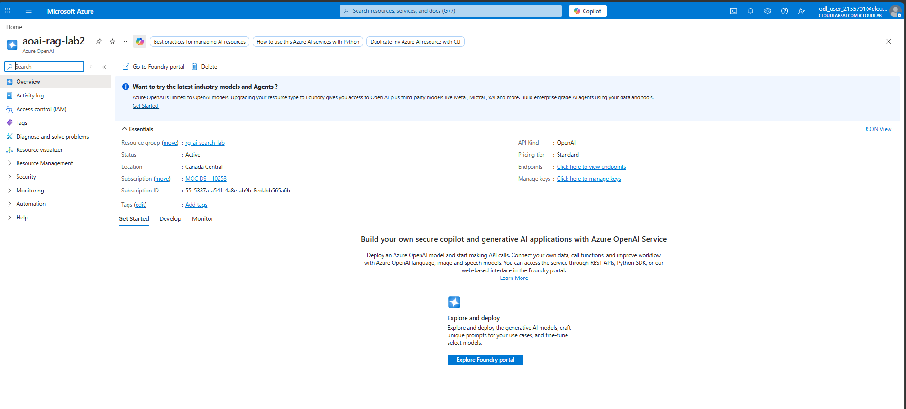
5.	Storage Account : stsearchlabfiles 
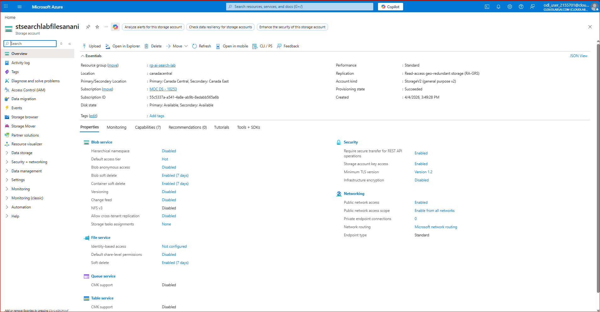
6.	Optional: Azure AI Foundry project for model management
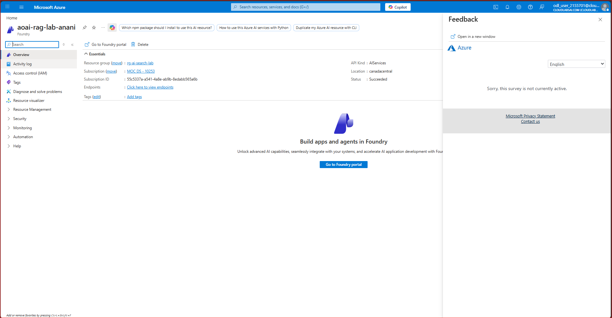

### Module 2 — Deploy Embedding and LLM Models
1.	Open Azure OpenAI / Foundry
2.	Create model deployment for embeddings
3.	Create model deployment for chat
4.	Save:
•	Endpoint
•	API key
•	deployment names
- Students should record:
•	AZURE_OPENAI_ENDPOINT
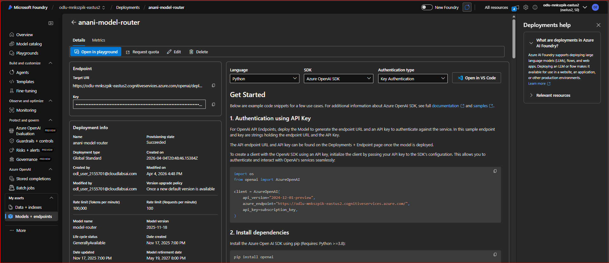
•	AZURE_OPENAI_API_KEY
•	EMBEDDING_MODEL_DEPLOYMENT
•	CHAT_MODEL_DEPLOYMENT
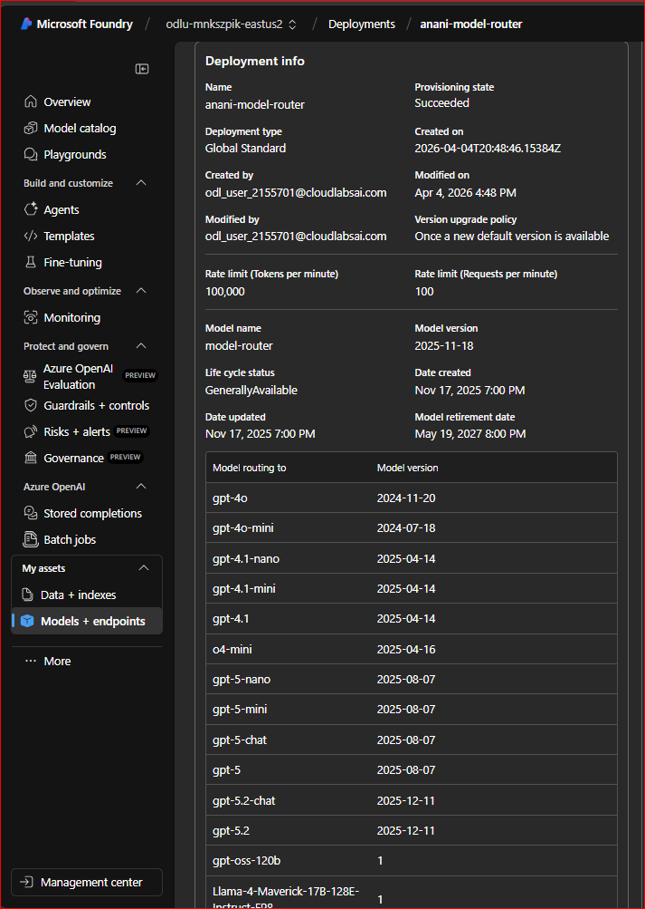
- I use both checked on the picture
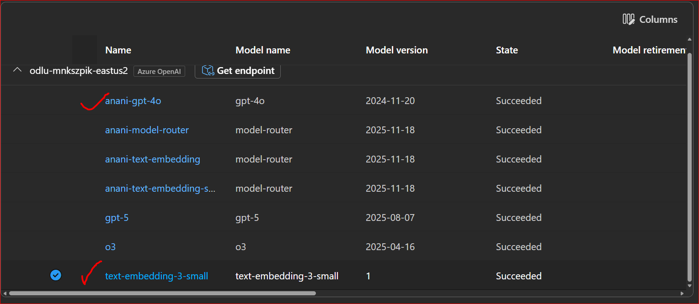

### Module 3 — Prepare Source Documents
- Upload files to a container in Azure Storage:Container name: documents
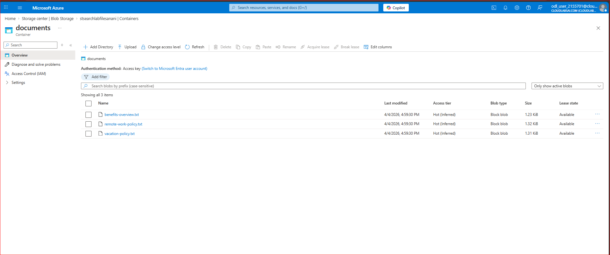

### Module 4 & 5 — Create the Search Index
- Option B — Better for learning: Create the index manually so students understand the schema.
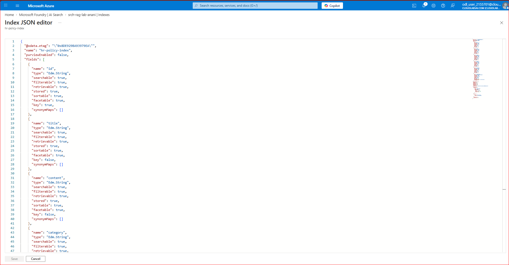

### Module 6 — Generate Embeddings and Load Documents
1.	Read document text
2.	Split into chunks
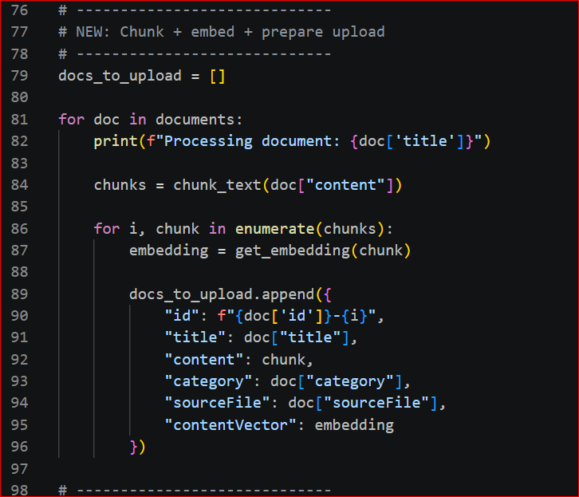
3.	Call embedding model
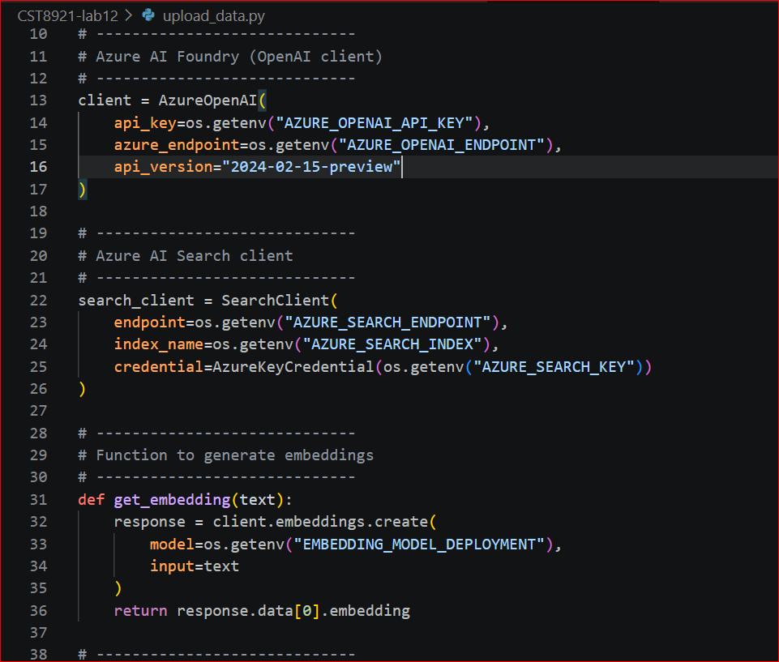
4.	Upload documents with vectors to Azure AI Search
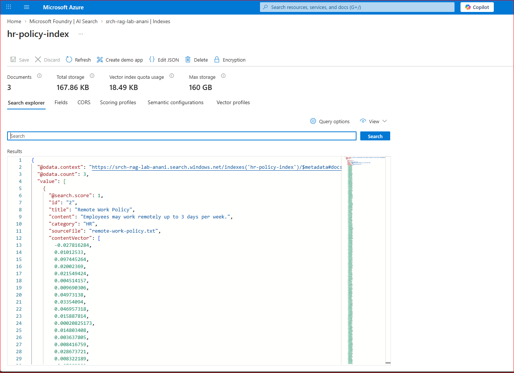

### Module 7 — Run Vector and Hybrid Search Queries
A. Keyword search
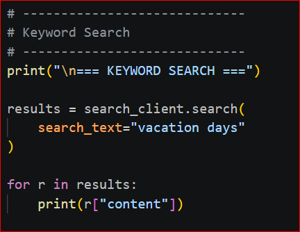
B. Vector search
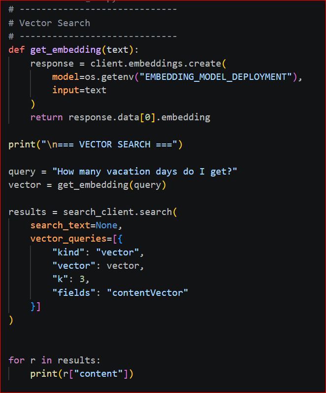
C. Hybrid search
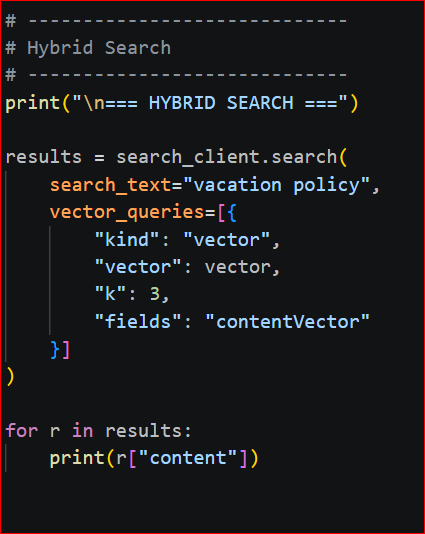
- Ouputs
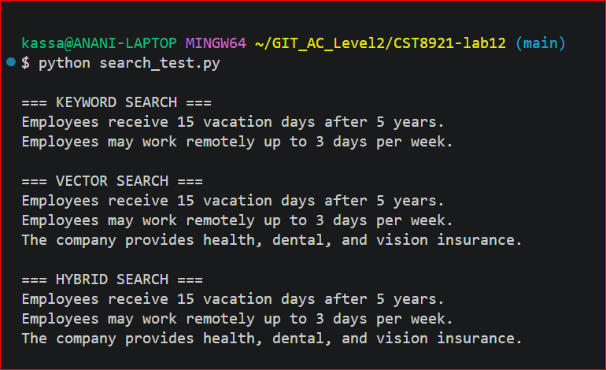

### Module 8 — Add the LLM Layer
1.	User asks question
2.	Search index retrieves top 3–5 chunks
3.	Construct prompt with context
4.	Send prompt to chat model
5.	Return answer with sources
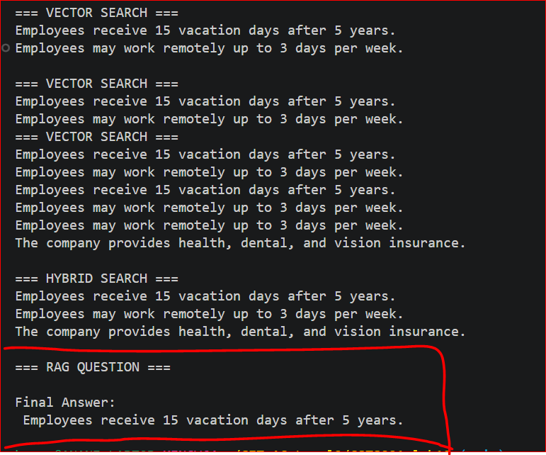
